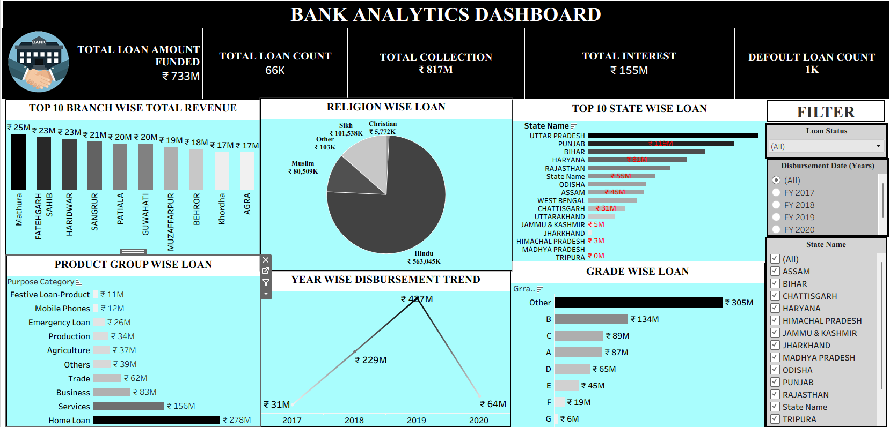

# 🏦 Bank Analytics Dashboard

This dashboard provides a detailed analysis of **bank loan data**, visualized across multiple dimensions such as branches, product groups, states, religions, and loan grades.  
It helps identify revenue sources, loan disbursement trends, and default patterns in an interactive and insightful way.

---
use dataset = https://github.com/Pranita1920/DATA_ANALYSIS_PROJECTS/blob/main/bank_ANALYTICS_DASHBOARD_PROJECT_1.twbx
## 📊 Dashboard Highlights

| Metric | Value |
|--------|--------|
| **Total Loan Amount Funded** | ₹733M |
| **Total Loan Count** | 66K |
| **Total Collection** | ₹817M |
| **Total Interest** | ₹155M |
| **Default Loan Count** | 1K |
---
## 📈 Key Insights
### 🔹 **Top 10 Branch Wise Total Revenue**
Branches like **Mathura, Fatehgarh, Saharanpur, Haridwar, and Sangrur** lead in total loan revenue.
### 🔹 **Religion Wise Loan**
- **Hindu**: ₹563,045K  
- **Muslim**: ₹80,509K  
- **Sikh**: ₹101,538K  
- **Christian**: ₹5,772K  
- **Other**: ₹103K  

### 🔹 **Top 10 State Wise Loan**
- **Uttar Pradesh**, **Punjab**, and **Bihar** are the top-performing states.
- Other states such as **Haryana**, **Rajasthan**, and **Odisha** show moderate funding levels.

### 🔹 **Product Group Wise Loan**
| Category | Loan Amount |
|-----------|--------------|
| Home Loan | ₹278M |
| Services | ₹156M |
| Business | ₹83M |
| Trade | ₹62M |
| Agriculture | ₹37M |
| Production | ₹34M |
| Emergency | ₹26M |
| Mobile Phones | ₹12M |
| Festive Loans | ₹11M |

### 🔹 **Year Wise Disbursement Trend**
- **2017:** ₹31M  
- **2018:** ₹229M  
- **2019:** ₹427M *(Peak year)*  
- **2020:** ₹64M *(Decline due to economic slowdown)*  

### 🔹 **Grade Wise Loan**
Grades are distributed as follows:  
Other ₹305M, B ₹134M, C ₹89M, A ₹87M, D ₹65M, E ₹45M, F ₹19M, G ₹6M.

---

## 🧰 Tools & Technologies Used
- **Microsoft Excel** – Data cleaning and visualization  
- **Tableau / Power BI** – Dashboard creation and analysis  
- **Canva / Snipping Tool** – Design and presentation enhancement
- ---
## 📸 Dashboard Preview

---

## 🚀 How to Use
1. Download the Excel or Tableau file from the repository.
2. Open it in your BI tool (Excel / Tableau / Power BI).
3. Use the filters (State, Loan Status, Year) to interact with the visualizations.
4. Analyze patterns in loan collection, disbursement, and performance metrics.
---

